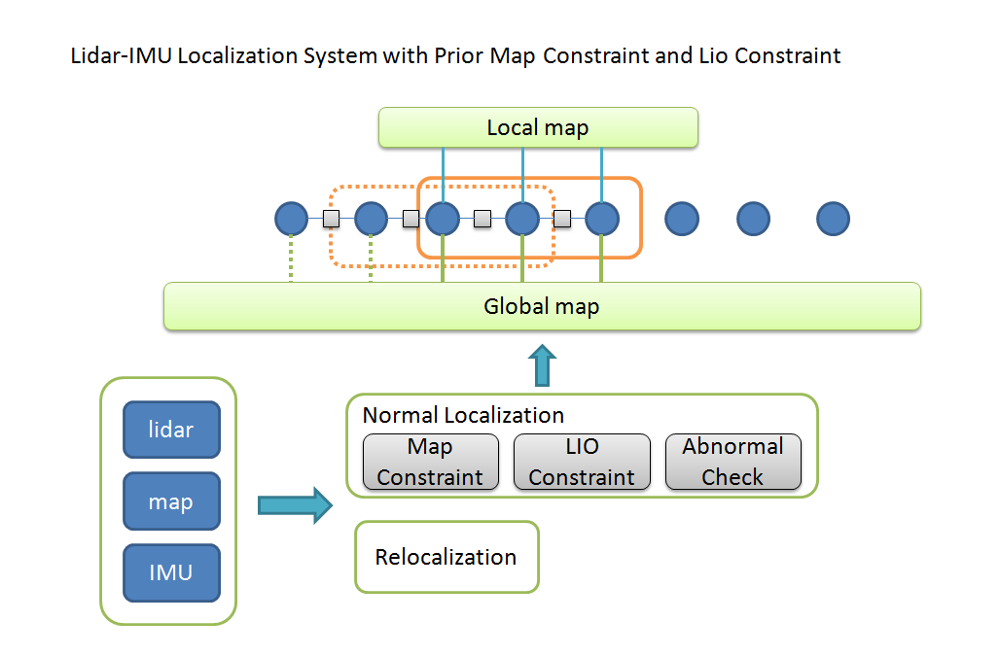
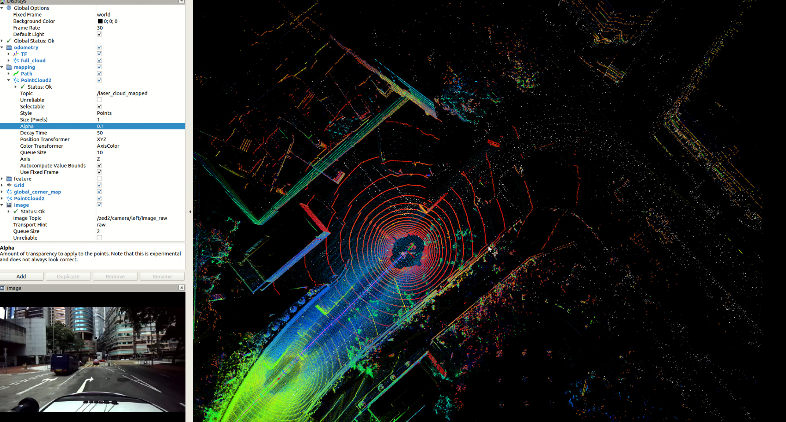

<a href="#"></img></a>
  <a href="#"></img></a>
  <a href="#"></img></a>
  <a href="#"></img></a>
  <a href="https://github.com/chengwei0427/Lidar_IMU_Localization/issues"></img></a>
  <a href="https://github.com/chengwei0427/Lidar_IMU_Localization/graphs/contributors"></img></a>


# Lidar-IMU-Localization

This repository is a Lidar-IMU Localization System with Prior Map Constraint and Lio Constraint for 3D LiDAR. The system is developed based on the open-source odometry framework [**LIO-Livox**](https://github.com/Livox-SDK/LIO-Livox). And the feature extract moudle is implemented based on [**LIO-SAM**](https://github.com/TixiaoShan/LIO-SAM) .

<div align="center">

</div>


  * Mapping Moudle
    - A Modified FeatureExtract Function adapt for traditional spinning lidar,such as velodyne,ouster,robosense etc. ;
    - A Modified Tightly coupled Lidar-imu laserodometry [LIO-Livox-modified](https://github.com/chengwei0427/LIO-Livox-modified);
  * Localization Moudle
    - A Lidar-IMU Localization System with Prior Map Constraint and Lio Constraint for 3D LiDAR;
    - Three IMU_Mode: 0-without using IMU, 1-loose couple IMU and Lidar, 2-tightly coupled IMU and LiDAR;
    - Automatic switch Map-Location mode and LIO-Location mode;

update 2022-09-21

**The Tightly Coupled Lidar-imu will upload before October 1st**

# demo


<div align="center">

</div>
A test video of the dataset can be found on [BiliBili](https://www.bilibili.com/video/BV1hT411M7cN?spm_id_from=333.999.0.0&vd_source=438f630fe29bd5049b24c7f05b1bcaa3)


<div align="center">

</div>
UrbanNavDataset test video can be found [here](https://www.bilibili.com/video/BV1nG411g7ym/?spm_id_from=333.999.0.0&vd_source=438f630fe29bd5049b24c7f05b1bcaa3)

## Prerequisites

*  [Ubuntu](http://ubuntu.com) (tested on 18.04)
*  [ROS](http://wiki.ros.org/ROS/Installation) (tested with Melodic)
*  [Eigen](http://eigen.tuxfamily.org/index.php?title=Main_Page)
*  [Ceres Solver](http://ceres-solver.org/installation.html)
*  [PCL](http://www.pointclouds.org/downloads/linux.html)
*  [livox_ros_driver](https://github.com/Livox-SDK/livox_ros_driver)
*  Suitesparse
   ```
   sudo apt-get install libsuitesparse-dev
   ```

## Compilation
```
cd ~/catkin_ws/src
git clone https://github.com/chengwei0427/Lidar_IMU_Localization
cd ..
catkin_make
```

## Run with bag 

(1) generate global map with [LIO-SAM-modified](https://github.com/chengwei0427/LIO-SAM-modified)

```
roslaunch GC_LOAM run.launch  
```

```
rosbag play yourbagname.bag --clock
```

```
rosserve call /save_map 
```

(2) run localization with global map and your test bag

```
rosbag LIO_Localization run_loc.launch
```

```
rosbag play yourbagname.bag --clock
``` 

```
Set initial pose in rviz
```

## Notes

The current version of the system is just a demo and we haven't done enough tests.

There are some parameters in params.yaml files:

*  IMU_Mode: choose IMU information fusion strategy, there are 3 modes:
    -  0 - without using IMU information, pure LiDAR odometry, motion distortion is removed using a constant velocity model (added 2022-09-16)
    -  1 - using IMU preintegration to remove motion distortion (added 2022-09-19)
    -  2 - **tightly coupling IMU and LiDAR information (will support later)**


## TODO

  - [ ] support tightly coupling IMU and LiDAR in Localization moudle
  - [ ] estimated positioning accuracy
  - [ ] abnormal check
  - [x] add test video
  - [x] add demo example


## Acknowledgements

Thanks for LOAM,[LIO_SAM](https://github.com/TixiaoShan/LIO-SAM) ,[LIO-Livox](https://github.com/Livox-SDK/LIO-Livox).

## Support
