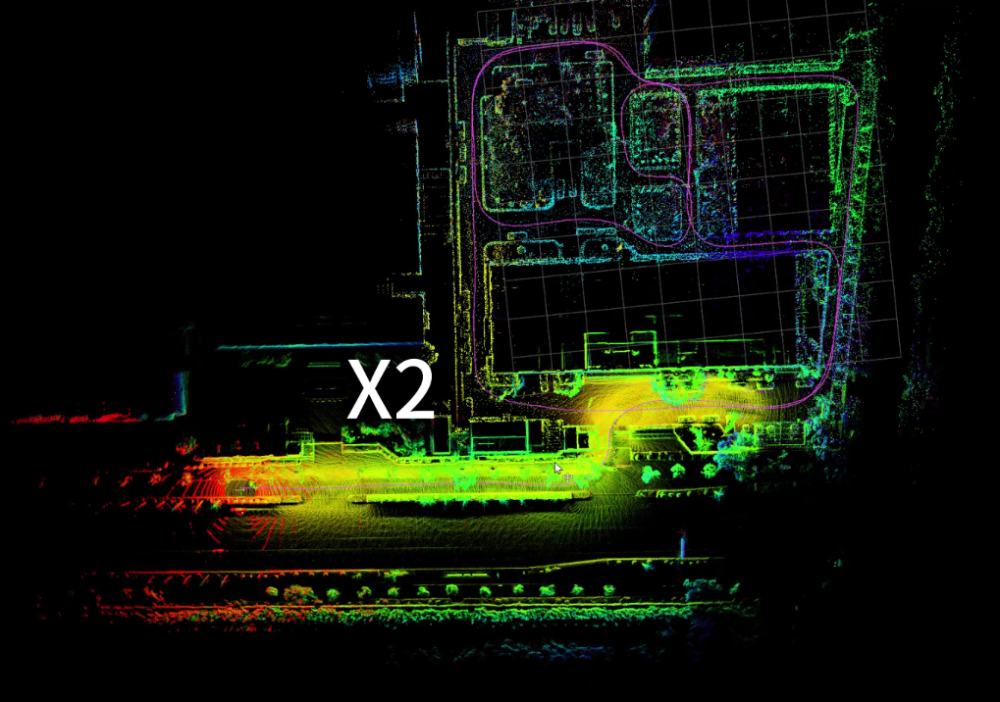

<a href="#"></img></a>
  <a href="#"></img></a>
  <a href="#"></img></a>
  <a href="#"></img></a>
  <a href="https://github.com/chengwei0427/Lidar_IMU_Localization/issues"></img></a>
  <a href="https://github.com/chengwei0427/Lidar_IMU_Localization/graphs/contributors"></img></a>


# Lidar-IMU-Localization

This repository is a Lidar-IMU Localization System with Prior Map Constraint and Lio Constraint for 3D LiDAR. The system is developed based on the open-source odometry framework [**LIO-Livox**](https://github.com/Livox-SDK/LIO-Livox). And the feature extract moudle is implemented based on [**LIO-SAM**](https://github.com/TixiaoShan/LIO-SAM) .

<div align="center">

</div>

## Modification

  - TBA
  


## demo

<div align="center">

</div>


## Prerequisites

*  [Ubuntu](http://ubuntu.com) (tested on 18.04)
*  [ROS](http://wiki.ros.org/ROS/Installation) (tested with Melodic)
*  [Eigen](http://eigen.tuxfamily.org/index.php?title=Main_Page)
*  [Ceres Solver](http://ceres-solver.org/installation.html)
*  [PCL](http://www.pointclouds.org/downloads/linux.html)
*  [livox_ros_driver](https://github.com/Livox-SDK/livox_ros_driver)
*  Suitesparse
   ```
   sudo apt-get install libsuitesparse-dev
   ```

## Compilation
```
cd ~/catkin_ws/src
git clone https://github.com/chengwei0427/Lidar_IMU_Localization
cd ..
catkin_make
```

## Run with bag files:

--add later

## Notes:


## Acknowledgements


## Support
